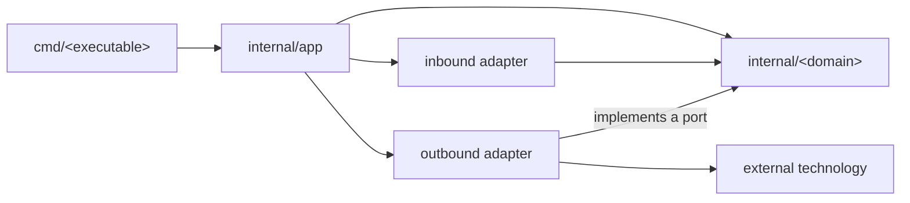

# Architecture Guidelines

## 1. Architectural Style

The repository follows a **pragmatic modular hexagonal architecture** within a modular monolith.

- The core is organized around business capabilities in `internal/<domain>/`.
- Ports are declared in the module that consumes them.
- Adapters are organized by interface or technology in `internal/adapters/`.
- Concrete dependencies are wired in `internal/app/`.
- Executables are located in `cmd/<executable>/`.
- Interfaces and subpackages are created only when a real boundary exists.

## 2. Layout

```text
cmd/
└── <executable>/
    └── main.go

internal/
├── app/
│   ├── app.go
│   └── config.go
│
├── <domain>/
│   ├── <domain>.go
│   ├── service.go
│   ├── repository.go
│   └── errors.go
│
└── adapters/
    ├── <input>/
    │   └── <domain>_commands.go
    └── <technology>/
        └── <domain>_repository.go
```

- Each directory represents a package and an architectural boundary.
- Files represent responsibilities, not mandatory layers.
- Only files required by existing behavior are created.
- A package is split into files first; subpackages are created only when a stable internal boundary emerges.
- If an adapter grows, it may be subdivided as `adapters/<technology>/<domain>/`.

## 3. Dependency Rule



1. Domain modules do not import `adapters`, `app`, or `cmd`.
2. Inbound adapters invoke domain use cases.
3. Outbound adapters implement ports declared by the domain.
4. External technology types do not cross core contracts.
5. Dependencies between domains are explicit, unidirectional, and cycle-free.
6. `internal/app` is the only place that wires concrete implementations.

## 4. Modules and Contracts

- Each module represents a cohesive business capability.
- Module-specific types, rules, use cases, ports, and errors remain inside `internal/<domain>/`.
- `repository.go` contains the contract required by the module; its implementation lives in the corresponding adapter.
- Interfaces are declared from the consumer's perspective.
- Methods that perform I/O accept `context.Context`.
- Contracts use core types rather than framework or external technology types.
- Repositories expose domain operations; a shared generic CRUD repository is not used.
- Business logic is not placed in adapters, `app`, or `cmd`.

A module starts flat. As its use cases grow, they are split by responsibility without introducing subpackages:

```text
internal/<domain>/
├── <domain>.go
├── create.go
├── get.go
├── list.go
├── repository.go
└── errors.go
```

## 5. File Responsibilities

| File | Contents |
| --- | --- |
| `internal/<domain>/<domain>.go` | Module types, entities, rules, and invariants |
| `internal/<domain>/service.go` | Use cases while they can remain cohesive |
| `internal/<domain>/<operation>.go` | A use case extracted when `service.go` grows |
| `internal/<domain>/repository.go` | Persistence port required by the module |
| `internal/<domain>/<port>.go` | Another port required by the module |
| `internal/<domain>/errors.go` | Module-specific errors |
| `internal/adapters/<input>/<domain>_commands.go` | Commands or handlers, input validation, and presentation |
| `internal/adapters/<technology>/<domain>_repository.go` | Repository implementation and model conversions |
| `internal/app/app.go` | Dependency construction and wiring |
| `internal/app/config.go` | Application-wide configuration |
| `cmd/<executable>/main.go` | Process startup and execution |

File names are responsibility references. A file is created only when its corresponding code exists.
