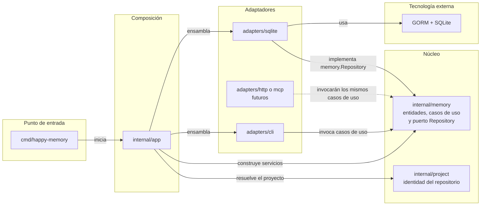

# Lineamientos de arquitectura

## 1. Propósito

`happy-memory` es una aplicación local para persistir memoria de agentes. La primera interfaz será un CLI, pero el núcleo deberá poder ser consumido en el futuro por HTTP, MCP u otros adaptadores sin duplicar reglas de negocio.

El sistema usará inicialmente SQLite y GORM. Las memorias estarán aisladas por proyecto. Un proyecto representa un repositorio y todos sus worktrees deben resolver el mismo `project_id` y, por tanto, compartir memoria.

El alcance inicial contempla guardar, obtener, listar, buscar por texto completo y eliminar memorias con metadatos. El versionado mediante snapshots se diseñará en una iteración posterior; la arquitectura no debe impedirlo, pero tampoco debe introducir abstracciones de versionado antes de definir sus requisitos.

## 2. Estilo arquitectónico

Se adopta una **arquitectura hexagonal modular y pragmática** dentro de un monolito modular.

- **Hexagonal:** el núcleo no depende de Cobra, GORM, SQLite, HTTP ni MCP. Las tecnologías externas se conectan mediante adaptadores.
- **Modular:** el núcleo se organiza por capacidades del producto, inicialmente `memory` y `project`, no solo por capas técnicas globales.
- **Pragmática:** se crean interfaces únicamente donde existe una frontera real o una necesidad concreta de sustitución. No se crea un paquete ni una interfaz por cada operación.
- **Monolito modular:** inicialmente todo reside en un único módulo Go y se despliega como uno o pocos binarios. No hay servicios distribuidos.

La arquitectura debe permitir reemplazar una interfaz o mecanismo de persistencia sin reescribir las reglas del producto. No exige que todos los componentes sean intercambiables desde el primer día.

## 3. Regla de dependencias

Fuera de la raíz de composición, las dependencias entre módulos propios apuntan hacia el núcleo. `internal/app` es la excepción deliberada porque debe conocer las implementaciones para conectarlas. En el diagrama, `A --> B` significa que **A conoce, importa o llama a B**:



La flecha `SQLITE --> MEMORY` puede parecer contraintuitiva: existe porque `memory` define el contrato `Repository` que necesita y SQLite lo implementa. El núcleo no importa al adaptador SQLite. Esta inversión permite sustituir la persistencia sin cambiar los casos de uso.

Reglas obligatorias:

1. `internal/memory` y `internal/project` no importan paquetes de `internal/adapters` ni `internal/app`.
2. El núcleo no expone tipos de Cobra, GORM o SQLite.
3. Los adaptadores convierten sus representaciones externas a tipos del núcleo y viceversa.
4. `internal/app` es la raíz de composición: conoce las implementaciones concretas y las conecta.
5. `cmd/*` contiene puntos de entrada pequeños; no contiene reglas de negocio ni consultas a la base de datos.
6. Las interfaces se declaran cerca del código que las consume. Por ejemplo, `memory.Repository` pertenece al módulo `memory`, aunque SQLite proporcione su implementación.

## 4. Estructura inicial de archivos

```text
happy-memory/
├── cmd/
│   └── happy-memory/
│       └── main.go
├── internal/
│   ├── app/
│   │   ├── app.go
│   │   └── config.go
│   ├── memory/
│   │   ├── memory.go
│   │   ├── repository.go
│   │   ├── service.go
│   │   └── errors.go
│   ├── project/
│   │   ├── project.go
│   │   └── resolver.go
│   └── adapters/
│       ├── cli/
│       │   ├── root.go
│       │   ├── memory_commands.go
│       │   └── output.go
│       └── sqlite/
│           ├── database.go
│           ├── migrations.go
│           ├── models.go
│           └── memory_repository.go
├── docs/
│   └── architecture.md
├── go.mod
├── go.sum
└── Makefile
```

La estructura es un punto de partida, no una obligación de crear todos los archivos vacíos. Un archivo se separa cuando su responsabilidad ya existe y la separación mejora su comprensión o prueba.

### `cmd/`

Es la convención de Go para contener ejecutables. Cada subdirectorio es un posible binario y contiene un paquete `main`.

`cmd/happy-memory/main.go` solo debe preparar el contexto del proceso, invocar la composición de la aplicación, ejecutar el CLI y traducir el resultado a una salida del proceso. Una futura interfaz podría añadir `cmd/happy-memory-api` o `cmd/happy-memory-mcp` si necesita un proceso independiente.

### `internal/`

Contiene la implementación privada del módulo. Go impide que otros módulos importen estos paquetes. Esto evita convertir accidentalmente detalles internos en una API pública.

No se usa una carpeta `src/`: con Go Modules, la raíz que contiene `go.mod` ya es la raíz del código fuente y `src/` no añade ninguna restricción o semántica.

### `internal/app/`

Es la raíz de composición y controla el ciclo de vida de la aplicación:

- carga y valida configuración;
- resuelve el proyecto actual;
- abre y cierra la base de datos;
- ejecuta migraciones;
- construye repositorios, servicios y adaptadores;
- propaga cancelación y errores hacia el punto de entrada.

No contiene reglas sobre memorias ni consultas SQL.

### `internal/memory/`

Es el módulo central de memoria:

- define la entidad `Memory` y sus invariantes;
- expresa los casos de uso iniciales;
- define el puerto `Repository` requerido para persistir y buscar;
- define errores de negocio independientes del transporte.

Inicialmente, los casos de uso pueden agruparse en un único `Service`. Solo se dividirán en comandos o handlers individuales si el módulo crece y las operaciones adquieren dependencias o reglas claramente distintas.

### `internal/project/`

Representa la identidad del repositorio al que pertenece una memoria. Su `Resolver` obtiene un `project_id` estable y garantiza que el repositorio principal y sus worktrees produzcan la misma identidad.

El algoritmo de resolución y la interacción con Git quedan encapsulados aquí. Ni el CLI ni el repositorio SQLite deben calcular la identidad del proyecto. El almacenamiento recibe un `project_id` ya resuelto.

### `internal/adapters/cli/`

Traduce argumentos, flags, entrada estándar y señales del proceso a llamadas de casos de uso. También presenta resultados y convierte errores conocidos en mensajes y códigos de salida apropiados.

Los comandos de Cobra no acceden directamente a GORM ni construyen consultas SQL. El adaptador puede depender de interfaces pequeñas definidas desde la perspectiva del propio CLI cuando eso facilite pruebas.

### `internal/adapters/sqlite/`

Implementa los puertos de persistencia mediante GORM y SQLite. Es el único lugar que conoce modelos con etiquetas de GORM, detalles de tablas, índices, consultas de texto completo y configuración específica del motor.

Los modelos persistentes y las entidades del dominio se mantienen separados cuando su estructura o ciclo de vida difieren. El adaptador realiza el mapeo entre ambos; no se agregan etiquetas de GORM a `memory.Memory` por conveniencia.

## 5. Límites y contratos

El puerto de persistencia expresa lo que necesita el caso de uso, no todas las capacidades de GORM. Conceptualmente debe soportar las operaciones iniciales de creación, obtención, listado, búsqueda y eliminación dentro de un proyecto.

Todos los métodos que puedan realizar I/O reciben `context.Context`. El `project_id` forma parte explícita de las consultas para impedir lecturas o escrituras cruzadas entre proyectos.

Las opciones de listado y búsqueda se representan mediante tipos propios, por ejemplo filtros, paginación y ordenamiento. No se pasan objetos `*gorm.DB`, fragmentos SQL ni tipos de Cobra a través del contrato.

No se introduce inicialmente un puerto genérico de transacciones. Cuando aparezca un caso de uso con varias escrituras que deban ser atómicas, se añadirá una abstracción de unidad de trabajo ajustada a ese caso concreto.

## 6. Flujo de una operación

Una operación del CLI sigue este flujo:

```text
Usuario
  -> comando Cobra
  -> adaptador CLI valida y normaliza entrada
  -> servicio de memoria aplica reglas del caso de uso
  -> puerto memory.Repository
  -> adaptador SQLite ejecuta GORM/SQL
  -> servicio devuelve un resultado o error del núcleo
  -> CLI lo presenta y selecciona el código de salida
```

Una futura API HTTP o interfaz MCP reemplaza únicamente el primer y último tramo. Reutiliza los mismos servicios y puertos.

## 7. Persistencia y búsqueda

SQLite es un detalle del adaptador. La base de datos debe vivir en una ubicación compartida por los worktrees, no dentro del directorio particular de uno de ellos. Las filas se particionan lógicamente mediante `project_id` y los índices deben comenzar por esa columna cuando el patrón de consulta lo requiera.

La búsqueda de texto completo se implementa en el adaptador SQLite usando las capacidades FTS de SQLite. El servicio expresa una búsqueda textual sin conocer tablas virtuales, triggers ni sintaxis SQL.

Las migraciones son explícitas, versionadas y ejecutadas durante el arranque bajo control de `internal/app`. GORM puede participar en operaciones de esquema sencillas, pero no se depende exclusivamente de `AutoMigrate`, porque FTS, triggers y futuras transformaciones de datos requieren SQL y versiones controladas.

La configuración de conexión, las opciones de concurrencia y los pragmas de SQLite se centralizan en `database.go`. No deben repetirse en repositorios individuales.

## 8. Errores, salida y observabilidad

El núcleo define errores que expresan situaciones del producto, como memoria inexistente, entrada inválida o conflicto. Conserva la causa técnica cuando sea útil, pero no redacta mensajes de consola ni códigos HTTP.

Cada adaptador traduce esos errores a su protocolo:

- CLI: mensaje para `stderr` y código de salida;
- HTTP futuro: estado y cuerpo de respuesta;
- MCP futuro: error de herramienta o resultado estructurado.

Los errores inesperados conservan contexto mediante wrapping. Los mensajes y logs no deben incluir el contenido completo de una memoria de forma predeterminada, ya que puede contener datos sensibles.

La salida funcional del CLI se mantiene separada de los logs diagnósticos. Esto permitirá ofrecer formatos estables, como JSON, sin mezclar información de depuración.

## 9. Estrategia de pruebas

La pirámide inicial de pruebas será:

1. **Pruebas unitarias del núcleo:** servicios de `memory` con un repositorio falso o stub, cubriendo reglas, filtros y errores.
2. **Pruebas de integración SQLite:** repositorio real contra una base temporal, ejecutando las migraciones reales y verificando aislamiento por `project_id` y búsqueda FTS.
3. **Pruebas del adaptador CLI:** comandos con dependencias inyectadas y buffers para `stdin`, `stdout` y `stderr`, sin abrir una base real salvo en pruebas de integración.
4. **Pruebas de extremo a extremo mínimas:** compilar o ejecutar el binario contra un entorno temporal para validar composición, migraciones y códigos de salida.

Las pruebas del núcleo no importan Cobra ni GORM. Las pruebas de persistencia comprueban comportamiento observable y no la cadena exacta de SQL generada por GORM.

## 10. Evolución prevista

### Nuevas interfaces

HTTP y MCP se añaden como adaptadores hermanos de `cli`. Si necesitan procesos separados, se agregan nuevos puntos de entrada en `cmd/`. No deben crear servicios de negocio paralelos.

### Snapshots y versionado

El versionado es una iteración posterior. Cuando se definan su granularidad, restauración y retención, se decidirá si forma parte de `memory` o merece un módulo propio. La implementación deberá reutilizar la raíz de composición y los límites de persistencia existentes.

### API pública para Go

Los paquetes bajo `internal/` no son importables desde otros módulos. Si en el futuro se decide publicar una librería Go, se diseñará deliberadamente un paquete público fuera de `internal/` que exponga una API estable y delegue en la implementación privada. Las futuras interfaces HTTP o MCP no obligan por sí mismas a publicar una librería Go.

## 11. Decisiones que se deben evitar

- Colocar reglas de negocio dentro de comandos Cobra, callbacks de GORM o modelos de persistencia.
- Importar GORM desde `internal/memory` o `internal/project`.
- Usar un repositorio genérico CRUD que borre el lenguaje específico del dominio.
- Crear interfaces para cada struct sin una frontera o consumidor real.
- Calcular el `project_id` de formas distintas en cada interfaz.
- Usar la ruta del worktree como identidad del proyecto.
- Exponer entidades del dominio como contratos HTTP/MCP sin modelos de entrada y salida propios.
- Introducir una carpeta `src/` sin una necesidad externa concreta.
- Diseñar snapshots antes de precisar sus reglas funcionales.

## 12. Criterios para mantener la arquitectura

Una modificación respeta estos lineamientos cuando:

- un caso de uso puede ejecutarse sin Cobra y probarse sin SQLite;
- cambiar la presentación del CLI no exige cambiar reglas de memoria;
- cambiar una tabla o consulta no altera el contrato externo del servicio;
- todos los worktrees de un repositorio acceden al mismo `project_id`;
- añadir un adaptador HTTP o MCP reutiliza el núcleo existente;
- las dependencias tecnológicas permanecen en los puntos de entrada o adaptadores correspondientes.
