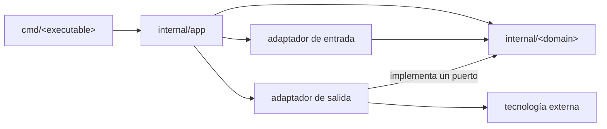

# Lineamientos de arquitectura

## 1. Estilo arquitectónico

Se adopta una **arquitectura hexagonal modular y pragmática** dentro de un monolito modular.

- El núcleo se organiza por capacidades del negocio en `internal/<domain>/`.
- Los puertos se declaran en el módulo que los consume.
- Los adaptadores se organizan por interfaz o tecnología en `internal/adapters/`.
- Las dependencias concretas se conectan en `internal/app/`.
- Los ejecutables se ubican en `cmd/<executable>/`.
- Las interfaces y subpaquetes se crean solo cuando existe un límite real.

## 2. Jerarquía

```text
cmd/
└── <executable>/
    └── main.go

internal/
├── app/
│   ├── app.go
│   └── config.go
│
├── <domain>/
│   ├── <domain>.go
│   ├── service.go
│   ├── repository.go
│   └── errors.go
│
└── adapters/
    ├── <input>/
    │   └── <domain>_commands.go
    └── <technology>/
        └── <domain>_repository.go
```

- Cada carpeta representa un paquete y un límite arquitectónico.
- Los archivos representan responsabilidades, no capas obligatorias.
- Solo se crean los archivos necesarios para el comportamiento existente.
- Un paquete se divide primero en archivos; se crean subpaquetes únicamente ante un límite interno estable.
- Si un adaptador crece, puede subdividirse como `adapters/<technology>/<domain>/`.

## 3. Regla de dependencias



1. Los módulos de dominio no importan `adapters`, `app` ni `cmd`.
2. Los adaptadores de entrada invocan casos de uso del dominio.
3. Los adaptadores de salida implementan puertos declarados por el dominio.
4. Los tipos de tecnologías externas no atraviesan los contratos del núcleo.
5. Las dependencias entre dominios son explícitas, unidireccionales y libres de ciclos.
6. `internal/app` es el único lugar que conecta implementaciones concretas.

## 4. Módulos y contratos

- Cada módulo representa una capacidad cohesionada del negocio.
- Tipos, reglas, casos de uso, puertos y errores propios permanecen dentro de `internal/<domain>/`.
- `repository.go` contiene el contrato requerido por el módulo; su implementación vive en el adaptador correspondiente.
- Las interfaces se declaran desde la perspectiva del consumidor.
- Los métodos con I/O reciben `context.Context`.
- Los contratos utilizan tipos del núcleo, no tipos de frameworks o tecnologías externas.
- Los repositorios exponen operaciones del dominio; no se usa un repositorio CRUD genérico compartido.
- La lógica de negocio no se coloca en adaptadores, `app` ni `cmd`.

Un módulo comienza plano. Si crecen sus casos de uso, se separan por responsabilidad sin cambiar de paquete:

```text
internal/<domain>/
├── <domain>.go
├── create.go
├── get.go
├── list.go
├── repository.go
└── errors.go
```

## 5. Agregar código

### Nuevo módulo

1. Crear `internal/<domain>/` con los archivos mínimos.
2. Agregar tipos, reglas y casos de uso.
3. Declarar únicamente los puertos requeridos.
4. Implementar sus entradas y salidas en `internal/adapters/`.
5. Conectar las implementaciones en `internal/app`.

### Nuevo caso de uso

1. Agregarlo al paquete del dominio.
2. Mantenerlo en `service.go` o separarlo en un archivo con el nombre de la operación.
3. Extender los puertos solo cuando el caso de uso lo requiera.
4. Exponerlo mediante el adaptador de entrada correspondiente.

### Nuevo adaptador

1. Crear o reutilizar `internal/adapters/<adapter>/`.
2. Mantener allí los tipos, conversiones y detalles de la tecnología.
3. Invocar casos de uso o implementar puertos existentes.
4. Registrar la implementación en `internal/app`.

## 6. Ubicación del código

| Responsabilidad | Ubicación |
| --- | --- |
| Tipo, regla o invariante del negocio | `internal/<domain>/` |
| Caso de uso | `internal/<domain>/service.go` o archivo por operación |
| Puerto requerido por un módulo | `internal/<domain>/<port>.go` |
| Implementación de tecnología externa | `internal/adapters/<technology>/` |
| Comando o handler | `internal/adapters/<input>/` |
| Composición de dependencias | `internal/app/` |
| Arranque de un proceso | `cmd/<executable>/main.go` |
