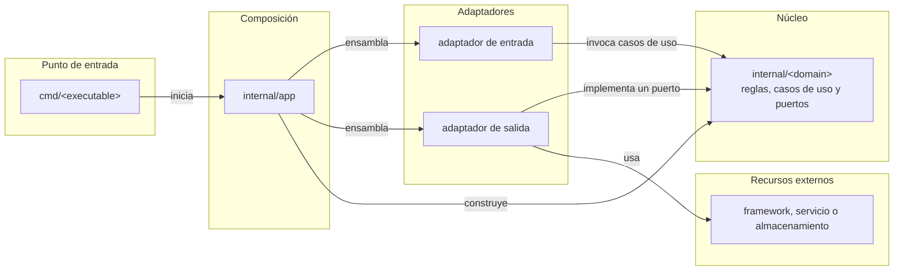

# Lineamientos de arquitectura

Esta guía define cómo organizar, extender y mantener el código respetando los límites arquitectónicos del repositorio.

## 1. Estilo arquitectónico

Se adopta una **arquitectura hexagonal modular y pragmática** dentro de un monolito modular.

- **Hexagonal:** el núcleo no depende de frameworks, protocolos ni mecanismos de persistencia. Las tecnologías externas se conectan mediante adaptadores.
- **Modular:** el núcleo se organiza por capacidades del negocio, no mediante capas técnicas globales.
- **Pragmática:** se crean interfaces únicamente cuando existe una frontera real. No se crea un paquete ni una interfaz por cada operación.
- **Monolito modular:** los módulos residen en un único módulo Go y se integran dentro del mismo proceso, aunque puedan existir varios ejecutables.

El objetivo del estilo es mantener las reglas del negocio independientes de sus mecanismos de entrada, salida y ejecución.

## 2. Componentes arquitectónicos

### Módulo de dominio

Un módulo representa una capacidad cohesionada del negocio y utiliza su propio vocabulario. Vive en `internal/<domain>/` y puede contener:

- tipos, entidades y reglas propias del dominio;
- casos de uso que coordinan esas reglas;
- contratos requeridos para comunicarse con recursos externos;
- errores independientes de cualquier protocolo.

Un módulo no contiene detalles de frameworks, almacenamiento ni presentación. Tampoco replica automáticamente subcarpetas como `domain/`, `usecases/` o `infrastructure/`.

### Puertos

Un puerto es un contrato que el núcleo necesita para comunicarse con algo externo. Se declara cerca de su consumidor, dentro del módulo de dominio.

Por ejemplo, si un caso de uso necesita persistencia, el módulo puede definir un `Repository`. Si necesita otra capacidad externa, utiliza un nombre que exprese esa capacidad en lugar de forzarla dentro de un repositorio genérico.

### Adaptadores

Un adaptador conecta el núcleo con una interfaz o tecnología externa:

- un adaptador de entrada traduce una solicitud externa a una llamada de caso de uso;
- un adaptador de salida implementa un puerto requerido por el núcleo.

Los adaptadores se agrupan por interfaz o tecnología en `internal/adapters/<adapter>/`. Pueden contener modelos propios y son responsables de convertirlos a tipos del dominio y viceversa.

### Raíz de composición

`internal/app/` construye la aplicación y conecta módulos, puertos y adaptadores concretos. Es el único componente que necesita conocer ambos lados de esas fronteras.

La raíz de composición administra el ciclo de vida general de las dependencias, pero no contiene reglas del negocio.

### Puntos de entrada

`cmd/<executable>/` contiene los paquetes `main` de los binarios. Un punto de entrada prepara el proceso, delega la construcción a `internal/app` y ejecuta la interfaz correspondiente.

Los puntos de entrada deben permanecer pequeños y no contener casos de uso ni integraciones concretas.

## 3. Regla de dependencias

Fuera de la raíz de composición, las dependencias entre componentes propios apuntan hacia el núcleo. En el diagrama, `A --> B` significa que **A conoce, importa o llama a B**:



Reglas:

1. Los módulos de dominio no importan adaptadores, puntos de entrada ni la raíz de composición.
2. Un adaptador de entrada invoca al núcleo; un adaptador de salida implementa un puerto definido por el núcleo.
3. Los tipos de tecnologías externas no atraviesan los contratos del dominio.
4. `internal/app` es la excepción deliberada a la dirección de dependencias porque ensambla implementaciones concretas.
5. Las dependencias entre módulos de dominio deben ser explícitas, unidireccionales y libres de ciclos.

## 4. Jerarquía de paquetes y archivos

La estructura de referencia es:

```text
cmd/
└── <executable>/
    └── main.go

internal/
├── app/
│   ├── app.go
│   └── config.go
│
├── <domain>/
│   ├── <domain>.go
│   ├── service.go
│   ├── repository.go
│   └── errors.go
│
└── adapters/
    ├── <input>/
    │   └── <domain>_commands.go
    └── <technology>/
        └── <domain>_repository.go
```

Esta estructura expresa responsabilidades posibles, no un conjunto obligatorio de archivos.

### Los archivos representan responsabilidades

En Go, la carpeta define el paquete y constituye el límite arquitectónico. Los archivos dentro de esa carpeta organizan las responsabilidades internas del paquete; no representan capas obligatorias ni unidades desplegables distintas.

Un módulo pequeño puede comenzar con uno o dos archivos. Archivos como `service.go`, `repository.go` o `errors.go` solo se crean cuando esas responsabilidades existen.

Cuando un archivo crece, primero se divide por responsabilidad sin cambiar de paquete:

```text
internal/<domain>/
├── <domain>.go
├── create.go
├── get.go
├── list.go
├── repository.go
└── errors.go
```

Todos los archivos continúan declarando el mismo paquete. Solo se introduce un subpaquete cuando aparece un límite interno estable, con una API clara y suficiente complejidad para justificarlo.

La regla práctica es: **módulos por capacidad del negocio, archivos por responsabilidad y subpaquetes solo ante complejidad real**.

### Organización de adaptadores

Los adaptadores se organizan primero por la interfaz o tecnología que encapsulan. Sus archivos pueden separarse por el módulo al que sirven:

```text
internal/adapters/<technology>/
├── <domain-a>_repository.go
└── <domain-b>_repository.go
```

Si un adaptador crece demasiado, puede incorporar subpaquetes por dominio:

```text
internal/adapters/<technology>/
├── <domain-a>/
│   └── repository.go
└── <domain-b>/
    └── repository.go
```

Esta subdivisión responde al tamaño y cohesión reales; no se crea preventivamente para cada combinación de dominio y adaptador.

## 5. Límites y contratos

Un contrato debe expresar lo que necesita su consumidor, no toda la API de la tecnología que lo implementa.

- Las interfaces se declaran cerca del consumidor.
- Los métodos que realizan I/O reciben `context.Context`.
- Los filtros, opciones y resultados utilizan tipos propios del núcleo.
- Los contratos no reciben conexiones, consultas, requests ni modelos pertenecientes a un framework.
- Los adaptadores traducen entre representaciones externas y tipos del dominio.
- Los errores del núcleo expresan situaciones del negocio; cada adaptador decide cómo representarlos en su protocolo.
- Una abstracción transversal se introduce cuando existe un caso de uso concreto que la necesita, no para anticipar posibilidades.

Un repositorio debe utilizar el lenguaje de su módulo y exponer las operaciones requeridas por sus casos de uso. Se evita un repositorio CRUD genérico compartido por todos los dominios.

## 6. Cómo agregar un módulo de dominio

1. **Definir la capacidad:** escoger un nombre basado en el lenguaje del negocio y establecer qué responsabilidad pertenece al módulo.
2. **Crear el paquete mínimo:** añadir `internal/<domain>/` únicamente con los archivos necesarios para el primer comportamiento.
3. **Modelar las reglas:** colocar tipos, invariantes y errores propios dentro del módulo.
4. **Agregar el caso de uso:** incorporar la coordinación en `service.go` o en un archivo nombrado por la operación.
5. **Definir los puertos necesarios:** declarar dentro del módulo las interfaces requeridas para comunicarse con recursos externos.
6. **Implementar adaptadores:** añadir las implementaciones en `internal/adapters/<adapter>/`, sin introducir la tecnología en el dominio.
7. **Ensamblar el módulo:** conectar implementaciones y casos de uso desde `internal/app`.
8. **Exponerlo cuando sea necesario:** agregar comandos, handlers u otra entrada dentro del adaptador correspondiente.

Antes de crear un nuevo módulo se debe confirmar que representa una capacidad cohesionada. Una variación técnica o una operación aislada normalmente pertenece a un módulo existente.

## 7. Cómo agregar un adaptador

1. Determinar si es de entrada o de salida.
2. Crear o reutilizar `internal/adapters/<adapter>/`.
3. Mantener dentro del adaptador los tipos y detalles propios de la tecnología.
4. Para una entrada, traducir solicitudes y respuestas alrededor de los casos de uso existentes.
5. Para una salida, implementar un puerto definido por el módulo consumidor.
6. Registrar la implementación concreta en `internal/app`.

Agregar un adaptador no debe exigir modificar las reglas del dominio. Si el contrato actual no cubre una necesidad real, se amplía desde el lenguaje del consumidor, no copiando la API de la tecnología.

## 8. Guía para ubicar código

| Responsabilidad | Ubicación |
| --- | --- |
| Tipo, regla o invariante del negocio | `internal/<domain>/` |
| Coordinación de un caso de uso | `internal/<domain>/service.go` o un archivo por operación |
| Interfaz requerida por un caso de uso | `internal/<domain>/<port>.go` |
| Implementación de una tecnología externa | `internal/adapters/<technology>/` |
| Comando, handler o traducción de protocolo | `internal/adapters/<input>/` |
| Construcción y conexión de dependencias | `internal/app/` |
| Arranque de un proceso | `cmd/<executable>/main.go` |

Si una responsabilidad parece encajar en varios lugares, se coloca junto a las reglas que provocarían su cambio. Las reglas del negocio permanecen en el dominio; los cambios motivados por una tecnología permanecen en su adaptador.

## 9. Directrices de mantenimiento

- Organizar el núcleo por capacidades del negocio, no mediante paquetes globales como `services`, `models` o `repositories`.
- Mantener los módulos de dominio independientes de frameworks y tecnologías externas.
- Declarar los puertos desde la perspectiva del módulo que los consume.
- Mantener la lógica de negocio fuera de adaptadores, composición y puntos de entrada.
- Preferir paquetes planos y dividir primero por archivos.
- Crear subpaquetes únicamente cuando exista un límite interno claro.
- Evitar ciclos entre módulos y dependencias implícitas mediante estado global.
- Evitar interfaces especulativas o creadas automáticamente para cada struct.
- Evitar repositorios CRUD genéricos que eliminen el vocabulario del dominio.
- Mantener la conversión de modelos y protocolos dentro de los adaptadores.
- Conectar todas las implementaciones concretas desde la raíz de composición.
