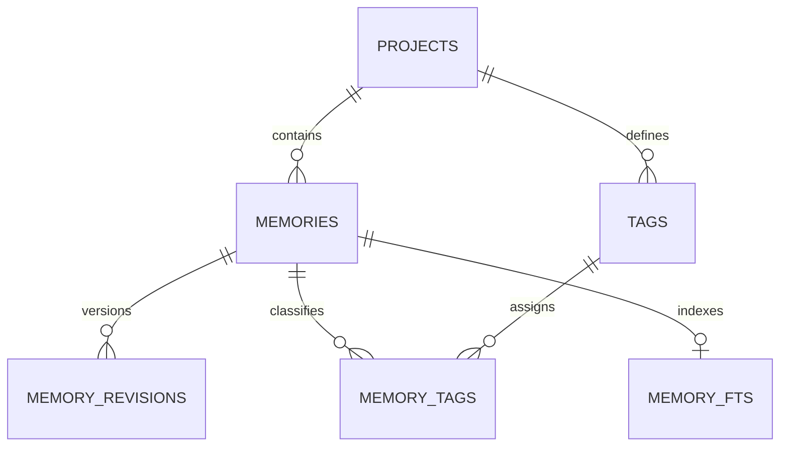

# Product Specification: happy-memory CLI POC

Date: 2026-08-05

Status: approved design pending written review

## 1. Purpose

`happy-memory` is a local CLI for persisting and retrieving memories used by AI agents working in Git repositories. The CLI is the deterministic intermediary between its consumers and the SQLite database local to the current repository and shared by its linked worktrees.

Semantic interpretation remains outside the CLI. The consumer decides what to search for, create, edit, or delete. The CLI is responsible for:

- Resolving the current project.
- Validating inputs.
- Preserving integrity and history.
- Searching text with FTS5.
- Applying deterministic filters and ranking.
- Producing stable JSON responses.

This specification describes the product, its contracts, and its data model. Repository architecture rules are documented separately in `docs/architecture.md`.

## 2. POC scope

The POC includes:

- One SQLite database beside each repository's Git common directory, shared by its linked worktrees.
- Strict logical isolation by `project_id`.
- Git repository initialization.
- Atomic, typed memories.
- CRUD through individual commands.
- Partial updates with optimistic version control.
- Soft deletion and restoration.
- History through complete, immutable snapshots.
- Free-form tags with optional descriptions, isolated by project.
- Exact duplicate prevention.
- Full-text search over title and content.
- Deterministic ranking based on BM25, importance, and confidence.
- JSON output for every command.
- Basic storage diagnostics.

The following are outside the POC:

- Hooks and when each integration invokes the CLI.
- Maintainer and recall skills.
- Initial retrieval without a query.
- Subagent specializations or audiences.
- Embeddings and vector search.
- Synchronization across machines or users.
- Automatic purging of memories or revisions.
- Database encryption.
- Storage of sessions, prompts, responses, or transcripts.
- Structured evidence or sources for memories.
- `archived` and `superseded` states.

The database is stored at `dirname(git-common-dir)/.happy-memory/memory.db`. Its directory and file are created only by a valid `init`, with permissions restricted to the current user. Git configuration stores the project identifier, never a database path.

## 3. Project identity and isolation

### 3.1 Identifier

Each initialized repository receives a UUID generated by `happy-memory`. The identifier is persisted under a product-specific key in the repository's shared local Git configuration.

The identifier is not derived from:

- The worktree path.
- The repository path.
- The Git remote.
- The current commit or branch.

### 3.2 Worktrees and clones

- Linked worktrees share Git's common configuration and therefore share the same `project_id`.
- An independent clone does not preserve local Git configuration and receives a new `project_id`.
- Moving a repository does not change its identity because the path is not part of the identifier.

### 3.3 Project resolution

Memory, tag, and search operations always resolve the project from the Git repository associated with the current working directory.

During the POC:

- Normal operations do not accept a `--project-id` flag.
- A command executed outside an initialized repository fails with `PROJECT_NOT_INITIALIZED`.
- `projects list` requires a Git repository and reads only its local database.

### 3.4 Initialization

```text
happy-memory init [--name <name>] [--configure-agent <agent[,agent...]>]
```

`init` is idempotent and must:

1. Verify that the current directory belongs to a Git repository.
2. Resolve the repository's common configuration.
3. Read the existing `project_id` or generate a new one.
4. Persist the identifier in Git configuration.
5. Create or reuse `.happy-memory/memory.db` beside the Git common directory.
6. Verify and apply required migrations.
7. Create or reconcile the project record in SQLite.
8. Verify full-text index availability.

If a `project_id` exists in Git but its SQLite record is missing, `init` recreates the record with the same identifier.

If `--name` is omitted, the display name is inferred from the repository's main directory. The name is descriptive and does not participate in identity.

## 4. Memory concept

### 4.1 Atomicity

Each record represents one reusable idea. The POC assumes short memories, but `content` is stored as text without a small limit that would prevent later experiments with longer content.

A memory has:

- A short title.
- Complete content.
- Exactly one type.
- Required importance and confidence values.
- Zero or more tags.
- Optional JSON attributes.
- A current version and a revision history.

There is no `summary` field. Compact representations use `title`.

### 4.2 Types

| Type | Meaning |
| --- | --- |
| `fact` | A verifiable, current fact about the project. |
| `decision` | A choice that was made and its context or rationale. |
| `constraint` | A mandatory rule or limit that must be respected. |
| `preference` | A desired convention that is not necessarily mandatory. |
| `procedure` | A reusable sequence for completing a task. |
| `lesson` | A known problem, finding, or lesson learned from experience. |

The type describes the nature of the memory. Topics are represented by tags rather than new types.

### 4.3 Importance and confidence

Both values are required integers from `1` to `5`.

- `importance` expresses the future impact of remembering the information.
- `confidence` expresses how reliable or confirmed the information is.

They are independent dimensions. A memory may be important but uncertain, or less important but fully confirmed.

The CLI validates and uses these values but does not decide how the consumer assigns them.

### 4.4 JSON attributes

`attributes_json` preserves optional structure specific to a memory type without requiring a different table for each type.

POC rules:

- It is optional.
- It must contain valid JSON.
- It is returned with the memory.
- It is preserved in every revision.
- It does not participate in full-text search.
- It does not participate in filtering or ranking.

If a property needs to be filtered, sorted, validated, or indexed in the future, it must be promoted to an explicit column or relationship.

## 5. Data model

### 5.1 Relationships



### 5.2 Projects

```text
projects
- id                         UUID, PK
- name                       TEXT NOT NULL
- last_known_git_common_dir  TEXT NOT NULL
- created_at                 TIMESTAMP NOT NULL
- updated_at                 TIMESTAMP NOT NULL
```

`last_known_git_common_dir` is informational. It may change when the repository moves and never participates in identity.

### 5.3 Memories

`memories` contains only the current state of each memory.

```text
memories
- row_id              INTEGER, internal PK for FTS5
- id                  UUID, unique public identifier
- project_id          UUID, FK → projects.id
- current_version     INTEGER NOT NULL
- type                TEXT NOT NULL
- title               TEXT NOT NULL
- content             TEXT NOT NULL
- importance          INTEGER NOT NULL
- confidence          INTEGER NOT NULL
- attributes_json     optional JSON
- content_hash        TEXT NOT NULL
- created_at          TIMESTAMP NOT NULL
- updated_at          TIMESTAMP NOT NULL
- deleted_at          optional TIMESTAMP
```

Constraints:

```text
type IN (fact, decision, constraint, preference, procedure, lesson)
importance BETWEEN 1 AND 5
confidence BETWEEN 1 AND 5
title is not empty
content is not empty
attributes_json is null or valid JSON
current_version >= 1
```

The pair `(id, project_id)` is also unique so composite foreign keys can enforce project isolation.

### 5.4 Duplicate detection

`content_hash` is a column derived by the CLI. Consumers cannot supply or edit it.

The fingerprint is calculated deterministically from a normalized representation of:

```text
type + title + content
```

It does not include tags or `attributes_json`.

Version 1 uses SHA-256. Before hashing, the CLI normalizes line endings to LF, trims outer whitespace from `title` and `content`, and preserves casing and internal whitespace. The three values are encoded with unambiguous boundaries to avoid collisions caused by ambiguous concatenation.

Only one active memory with the same hash may exist within a project:

```text
UNIQUE(project_id, content_hash) WHERE deleted_at IS NULL
```

This protects against exact duplicates. Detecting semantic equivalence remains outside the CLI.

### 5.5 Memory revisions

Every mutation creates an immutable revision containing a complete snapshot of the resulting state.

```text
memory_revisions
- id                         UUID, PK
- project_id                 UUID NOT NULL
- memory_id                  UUID NOT NULL
- version                    INTEGER NOT NULL
- operation                  create | update | delete | restore
- type_snapshot              TEXT NOT NULL
- title_snapshot             TEXT NOT NULL
- content_snapshot           TEXT NOT NULL
- importance_snapshot        INTEGER NOT NULL
- confidence_snapshot        INTEGER NOT NULL
- attributes_snapshot_json   optional JSON
- tags_snapshot_json         JSON NOT NULL
- content_hash_snapshot      TEXT NOT NULL
- deleted_at_snapshot        optional TIMESTAMP
- agent_name                 optional TEXT
- agent_role                 primary | subagent | unknown, default unknown
- worktree_path              TEXT NOT NULL
- created_at                 TIMESTAMP NOT NULL
```

Constraints:

```text
UNIQUE(memory_id, version)
FK(memory_id, project_id) → memories(id, project_id)
```

`agent_name` and `agent_role` are provenance metadata supplied by the consumer when available. They do not affect ranking. `worktree_path` is derived by the CLI and does not participate in project identity.

Revisions do not participate in normal searches.

### 5.6 Tags

Tags are free-form, reusable, and isolated by project.

```text
tags
- id                 UUID, PK
- project_id         UUID NOT NULL
- name               TEXT NOT NULL
- normalized_name    TEXT NOT NULL
- description        optional TEXT
- created_at         TIMESTAMP NOT NULL
- updated_at         TIMESTAMP NOT NULL
```

Constraints:

```text
UNIQUE(project_id, normalized_name)
UNIQUE(id, project_id)
```

Normalization lowercases the name, trims outer whitespace, replaces internal whitespace sequences with `-`, and collapses repeated hyphens. An empty result is invalid. Tags do not form a closed taxonomy.

```text
memory_tags
- project_id     UUID NOT NULL
- memory_id      UUID NOT NULL
- tag_id         UUID NOT NULL
- created_at     TIMESTAMP NOT NULL

PRIMARY KEY(memory_id, tag_id)
FK(memory_id, project_id) → memories(id, project_id)
FK(tag_id, project_id)    → tags(id, project_id)
```

Duplicating `project_id` in `memory_tags` lets the database prevent a memory from referencing a tag in another project.

A new tag may include an optional description. When a memory creation or update contains tags, the CLI reuses an existing normalized tag or creates a new tag within the project. A supplied description applies only when the tag is created; an existing tag retains its current description.

### 5.7 Full-text index

```text
memory_fts
- row_id
- title
- content
```

Rules:

- It indexes only the current state of active memories.
- `title` and `content` are the only searchable fields.
- The `title` weight is `5`.
- The `content` weight is `1`.
- `attributes_json`, revisions, and deleted memories are excluded.
- Synchronization with `memories` occurs in the same transaction as the mutation.

## 6. Operation semantics

### 6.1 Create

```text
happy-memory create --input -
```

Create receives a complete memory except for fields derived by the CLI.

```json
{
  "type": "decision",
  "title": "Worktrees share memory",
  "content": "The project_id is persisted in Git's common configuration.",
  "importance": 5,
  "confidence": 5,
  "attributes": {},
  "tags": [
    {
      "name": "git",
      "description": "Git repository identity and operations"
    },
    {
      "name": "worktrees"
    }
  ],
  "agent": {
    "name": "codex",
    "role": "primary"
  }
}
```

Create:

1. Validates the input.
2. Resolves or creates tags.
3. Calculates `content_hash`.
4. Rejects active duplicates.
5. Creates `memories` with version `1`.
6. Creates the version `1` `create` revision.
7. Updates FTS5.

### 6.2 Update

```text
happy-memory update <memory-id> --expected-version <n> --input -
```

Update receives a patch:

- An absent field preserves the current value.
- `attributes: null` removes the attributes.
- `tags: []` removes every tag.
- A present `tags` field replaces the complete tag set.
- A patch that does not change state does not create a revision.

When a change exists, update:

1. Compares `expected-version` with `current_version`.
2. Builds and validates the complete new state.
3. Recalculates `content_hash`.
4. Checks for active duplicates.
5. Increments the version.
6. Updates the current state.
7. Creates an `update` revision with a complete snapshot.
8. Synchronizes tags and FTS5.

### 6.3 Delete

```text
happy-memory delete <memory-id> --expected-version <n>
```

Delete is logical:

- It sets `deleted_at`.
- It increments the version.
- It creates a `delete` revision.
- It excludes the memory from FTS5, normal listings, and searches.
- It preserves the record, its revisions, and its current relationships so it can be restored.

The POC does not provide automatic hard deletion.

### 6.4 Restore

```text
happy-memory restore <memory-id> --version <n> --expected-version <n>
```

Restore copies the selected historical snapshot into the current state but does not rewind the version counter.

Restoration:

1. Checks `expected-version`.
2. Reads the requested snapshot.
3. Validates that it will not create an active duplicate.
4. Increments `current_version`.
5. Creates a new `restore` revision.
6. Restores tags and FTS5.

### 6.5 Get, list, and history

```text
happy-memory get <memory-id> [--include-deleted]
happy-memory list [filters] [--include-deleted]
happy-memory history <memory-id>
```

- `get` returns the current state by ID.
- `list` returns current memories for the active project without textual ranking. It accepts type, tag, importance, and confidence filters and orders by `updated_at DESC`, then `memory_id ASC`.
- `history` returns revisions ordered by version.
- `--include-deleted` lets `get` and `list` include soft-deleted memories for administrative inspection.
- Search never includes deleted memories.

### 6.6 Tags

```text
happy-memory tags list
happy-memory tags search <query> [--limit <n>]
```

The response includes at least:

- Identifier.
- Canonical name.
- Optional description.
- Number of active memories using the tag.

This lets a consumer reuse the existing vocabulary before creating tags.

`tags search` performs a case-insensitive text match over the name and description. It sorts first by active memory count and then by normalized name, and returns at most `--limit` results. The limit defaults to `10` and accepts values from `1` through `100`. `tags list` remains unlimited.

## 7. Search and ranking

### 7.1 Command

```text
happy-memory search "<query>" [filters]
happy-memory search --input -
```

The positional mode requires one query. The input mode receives 1–100 ordered,
independent searches as `{"searches":[...]}`. The two modes and their flags are
mutually exclusive. The POC does not include configurable profiles or bootstrap
search.

Initial filters:

```text
--type <type>
--tag <tag>
--min-importance <1-5>
--min-confidence <1-5>
--limit <n>
```

- Filters apply within the active project.
- Repeating `--tag` uses AND semantics.
- `--specific-tags "Orca,Codex"` optionally scopes matches to canonical tag
  tokens. Values are normalized, deduplicated, escaped as FTS phrases, and
  combined with AND; empty values are invalid.
- The general query always matches only `title` and `content`. Specific tags
  restrict that match through the derived `specific_tags` FTS column and carry
  zero BM25 weight, so they do not alter text relevance.
- `limit` has a maximum value of `100`.
- The query is treated as plain text. The CLI escapes special FTS5 syntax.
- Batch entries accept `query`, `type`, `tags`, `specific_tags`, `min_importance`,
  `min_confidence`, and `limit`; an omitted limit defaults to `10`.
- A batch resolves the project once and executes sequentially. Each entry keeps
  its own candidate window, normalization, ranking, result, or public error.
- Partial success exits zero and reports ordered item results plus
  `total`/`succeeded`/`failed`. Malformed input and common setup failures fail the
  whole command.

### 7.2 Ranking algorithm version 1

The process is:

1. Resolve `project_id`.
2. Exclude deleted memories.
3. Apply structured filters.
4. Retrieve candidates with BM25 over `title` and `content`.
5. Normalize textual relevance deterministically.
6. Normalize importance and confidence.
7. Calculate the final score.
8. Apply stable tie-breakers.

Metadata normalization:

```text
importance_score = (importance - 1) / 4
confidence_score = (confidence - 1) / 4
```

Formula:

```text
final_score =
    0.70 × text_score
  + 0.20 × importance_score
  + 0.10 × confidence_score
```

Candidates are first ordered by BM25. To convert textual position into a stable value from `0` to `1`, version 1 uses min-max normalization over a fixed window of up to `100` filtered candidates:

```text
text_score = (worst_bm25 - candidate_bm25) / (worst_bm25 - best_bm25)
```

If there is only one candidate or all candidates have the same BM25 score, every candidate receives a `text_score` of `1`.

Tie-breakers:

```text
final_score DESC
importance DESC
confidence DESC
updated_at DESC
memory_id ASC
```

The score is specific to each search and is not persisted.

### 7.3 Explainability

Every result includes the final score and its components:

```json
{
  "id": "mem_123",
  "type": "decision",
  "title": "Worktrees share memory",
  "content": "The project_id is stored in Git's common configuration.",
  "importance": 5,
  "confidence": 5,
  "tags": ["git", "worktrees"],
  "score": {
    "final": 0.91,
    "text": 0.87,
    "importance": 1.0,
    "confidence": 1.0
  }
}
```

The search response identifies the algorithm with `ranking_version: 1`. Consumers cannot configure the weights during the POC.

## 8. CLI contract

### 8.1 Commands

```text
happy-memory init [--name <name>] [--configure-agent <agent[,agent...]>]

happy-memory create --input -
happy-memory get <memory-id> [--include-deleted]
happy-memory update <memory-id> --expected-version <n> --input -
happy-memory delete <memory-id> --expected-version <n>
happy-memory restore <memory-id> --version <n> --expected-version <n>
happy-memory history <memory-id>

happy-memory search "<query>" [filters]
happy-memory search --input -
happy-memory list [filters] [--include-deleted]

happy-memory tags list
happy-memory tags search "<query>"

happy-memory project show
happy-memory projects list
happy-memory doctor
```

Mutations are individual commands. The POC has no batch operation.

### 8.2 Input

- Documents and patches are received as JSON through `stdin`.
- Simple arguments, IDs, versions, and filters use positional arguments and flags.
- The CLI must never interpolate a query as SQL or FTS syntax without validation and escaping.

### 8.3 Output

Every command produces JSON.

Success:

```json
{
  "ok": true,
  "data": {}
}
```

- Written to `stdout`.
- The process exits with code `0`.
- Dates and times use UTC and RFC 3339 format.

Error:

```json
{
  "ok": false,
  "error": {
    "code": "VERSION_CONFLICT",
    "message": "Expected version 2 but found version 3",
    "details": {
      "memory_id": "mem_123",
      "current_version": 3
    }
  }
}
```

- Written to `stderr`.
- The process exits with a nonzero code.
- Stack traces are omitted unless diagnostic mode is enabled.

### 8.4 Stable errors

```text
PROJECT_NOT_INITIALIZED
VALIDATION_ERROR
MEMORY_NOT_FOUND
DUPLICATE_MEMORY
VERSION_CONFLICT
STORE_BUSY
STORE_ERROR
```

`DUPLICATE_MEMORY` includes the existing active memory ID when available. `VERSION_CONFLICT` includes the current version.

## 9. Transactions, concurrency, and consistency

Each mutating command runs in one transaction covering:

- Current state.
- Revision.
- Tags and associations.
- Full-text index.

If any part fails, the entire operation is rolled back.

Operational requirements:

```text
foreign keys enabled
WAL enabled
busy timeout configured
short, bounded retries for write contention
```

SQLite permits multiple readers and one concurrent writer. Write transactions must remain short. If the database is still busy after retries, the CLI returns `STORE_BUSY`.

Migrations are versioned, embedded with the product, and transactional. Every command verifies schema compatibility before operating.

## 10. Diagnostics

```text
happy-memory doctor
```

`doctor` checks at least:

- Access to the database file.
- Schema version compatibility.
- Basic SQLite integrity.
- Foreign key enforcement.
- FTS5 availability.
- Consistency between active memories and the full-text index.

Diagnostics report problems as JSON. They do not perform destructive repairs automatically.

## 11. Validation and cross-cutting rules

- `title` and `content` are required and cannot be empty after trimming whitespace.
- `importance` and `confidence` are integers from `1` to `5`.
- `attributes` is null or a valid JSON object.
- IDs and versions must use the expected format.
- A deleted memory cannot be edited or deleted again; it must first be restored.
- A restoration may fail if it would create an active duplicate.
- Tags are unique by normalized name and project.
- Every normal query excludes deleted memories.
- Every operation respects the project resolved from Git.
- The CLI does not invoke models or interpret content semantically.

## 12. Acceptance criteria

### Identity

- Initializing two linked worktrees produces the same `project_id`.
- Initializing an independent clone produces a different `project_id`.
- Moving a repository does not change its `project_id`.
- No normal operation can manually select another project.

### Memories

- Create produces version `1` and its corresponding revision.
- Update applies patches and preserves complete snapshots.
- A no-op patch does not create a revision.
- Delete excludes a memory from searches without deleting its history.
- Restore creates a new version without rewinding the counter.
- Active exact duplicates are rejected within the same project.
- The same memory may exist in different projects.

### Tags

- Normalizable tag variations are reused within a project.
- Identical tags in different projects remain isolated.
- A relationship cannot link a memory and tag from different projects.
- Listing tags returns their descriptions and active memory counts.

### Search

- Search uses only `title` and `content`.
- Search never returns memories from another project or deleted memories.
- Search respects type, tag, importance, and confidence filters.
- The same database state, query, filters, and algorithm version produce the same order.
- Every result explains its score components.

### Concurrency and integrity

- Two updates based on the same version cannot silently overwrite each other.
- A failure while updating revisions, tags, or FTS rolls back the entire mutation.
- Readers can operate during short writes in WAL mode.
- Unresolved contention produces a JSON `STORE_BUSY` error.
- `doctor` detects an incompatible schema or inconsistent index.

## 13. Growth considerations

One shared database is sufficient for the POC and for a broad volume of local memories. The following conditions may justify future evolution:

- Frequent writer conflicts.
- Revision growth that makes maintenance expensive.
- A need to export, encrypt, or delete projects independently.
- Distributed synchronization or multi-user operation.
- Physical isolation requirements.

Most growth will come from `memory_revisions` because every mutation preserves a complete snapshot. Any future purge feature must be explicit, auditable, and separate from automatic maintenance.
