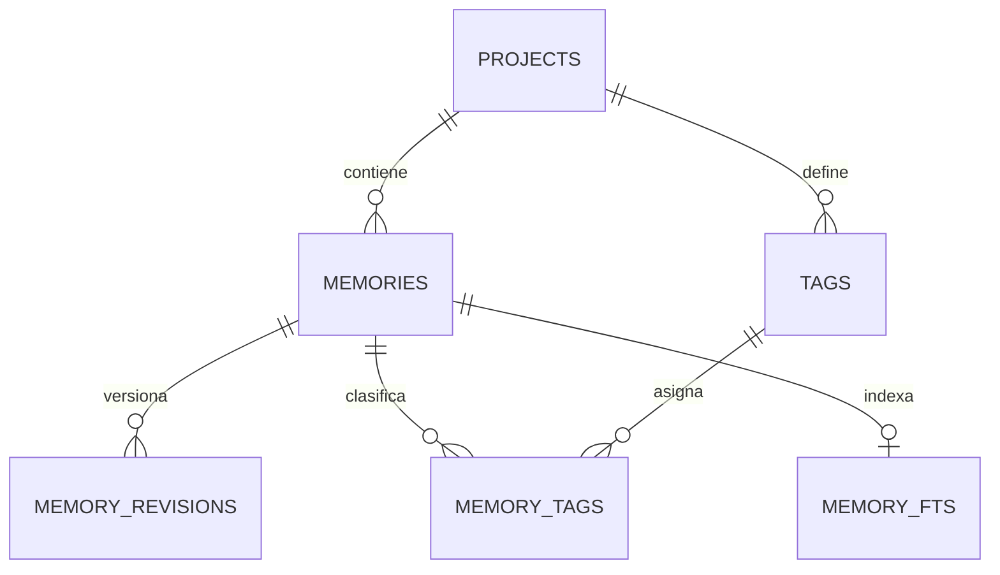

# Especificación de producto: happy-memory CLI POC

Fecha: 2026-08-05

Estado: diseño aprobado para revisión escrita

## 1. Propósito

`happy-memory` es un CLI local para persistir y recuperar memorias de agentes de IA que trabajan sobre repositorios Git. El CLI es el intermediario determinista entre los consumidores y una base SQLite compartida por todos los proyectos del usuario.

La interpretación semántica queda fuera del CLI. El consumidor decide qué buscar, crear, editar o eliminar. El CLI se ocupa de:

- Resolver el proyecto actual.
- Validar entradas.
- Mantener la integridad y el historial.
- Buscar texto mediante FTS5.
- Aplicar filtros y ranking determinista.
- Producir respuestas JSON estables.

Esta especificación describe el producto, sus contratos y su modelo de datos. Las reglas de arquitectura del repositorio están documentadas por separado en `docs/architecture.md`.

## 2. Alcance del POC

El POC incluye:

- Una única base SQLite global para todos los proyectos.
- Aislamiento lógico estricto por `project_id`.
- Inicialización de repositorios Git.
- Memorias atómicas y tipadas.
- CRUD mediante comandos individuales.
- Updates parciales con control optimista de versión.
- Soft delete y restauración.
- Historial mediante snapshots completos e inmutables.
- Tags libres, descritos opcionalmente y aislados por proyecto.
- Prevención de duplicados exactos.
- Full-text search sobre título y contenido.
- Ranking determinista basado en BM25, importancia y confianza.
- Salida JSON para todos los comandos.
- Diagnóstico básico del almacenamiento.

Quedan fuera del POC:

- Hooks y el momento en que cada integración invoca el CLI.
- Skills de maintainer y recall.
- Recuperación inicial sin una query.
- Especializaciones o audiencias de subagentes.
- Embeddings y búsqueda vectorial.
- Sincronización entre máquinas o usuarios.
- Purga automática de memorias o revisiones.
- Cifrado de la base.
- Almacenamiento de sesiones, prompts, respuestas o transcripciones.
- Evidencias o fuentes estructuradas por memoria.
- Estados `archived` y `superseded`.

La base se almacena fuera de los repositorios, en el directorio estándar de datos de aplicaciones del usuario. El directorio y el archivo deben crearse con permisos restringidos al usuario actual. El repositorio solo conserva su identificador en la configuración local de Git.

## 3. Identidad y aislamiento del proyecto

### 3.1 Identificador

Cada repositorio inicializado recibe un UUID generado por `happy-memory`. El identificador se persiste en la configuración local compartida de Git bajo una clave propia del producto.

El identificador no se deriva de:

- La ruta del worktree.
- La ruta del repositorio.
- El remote de Git.
- El commit o la rama actual.

### 3.2 Worktrees y clones

- Los worktrees enlazados comparten la configuración común de Git y, por tanto, el mismo `project_id`.
- Una clonación independiente no conserva la configuración local y recibe un nuevo `project_id`.
- Mover el repositorio no cambia su identidad, porque la ruta no forma parte del identificador.

### 3.3 Resolución del proyecto

Las operaciones de memoria, tags y búsqueda siempre resuelven el proyecto desde el repositorio Git correspondiente al directorio de trabajo actual.

Durante el POC:

- No existe un flag `--project-id` para operaciones normales.
- Un comando ejecutado fuera de un repositorio inicializado falla con `PROJECT_NOT_INITIALIZED`.
- Los comandos administrativos, como `projects list`, pueden ejecutarse fuera de un repositorio.

### 3.4 Inicialización

```text
happy-memory init [--name <name>]
```

`init` es idempotente y debe:

1. Verificar que el directorio pertenece a un repositorio Git.
2. Resolver la configuración común del repositorio.
3. Leer el `project_id` existente o generar uno nuevo.
4. Persistir el identificador en la configuración Git.
5. Crear o reconciliar el registro del proyecto en SQLite.
6. Verificar y aplicar las migraciones requeridas.
7. Verificar la disponibilidad del índice full-text.

Si existe un `project_id` en Git pero falta su registro en SQLite, `init` recrea el registro usando el mismo identificador.

Si no se proporciona `--name`, el nombre visible del proyecto se infiere del directorio principal del repositorio. El nombre es descriptivo y no participa en la identidad.

## 4. Concepto de memoria

### 4.1 Atomicidad

Cada registro representa una sola idea reutilizable. El POC asume memorias breves, pero `content` se almacena como texto sin imponer un límite pequeño que impida experimentar posteriormente con contenido más extenso.

Una memoria tiene:

- Un título breve.
- Un contenido completo.
- Exactamente un tipo.
- Importancia y confianza obligatorias.
- Cero o más tags.
- Atributos JSON opcionales.
- Una versión vigente y un historial de revisiones.

No existe un campo `summary`. Para representaciones compactas se utiliza `title`.

### 4.2 Tipos

| Tipo | Significado |
| --- | --- |
| `fact` | Hecho verificable y vigente del proyecto. |
| `decision` | Elección tomada y su contexto o razón. |
| `constraint` | Regla obligatoria o límite que debe respetarse. |
| `preference` | Convención deseada, pero no necesariamente obligatoria. |
| `procedure` | Secuencia reutilizable para realizar una tarea. |
| `lesson` | Problema conocido, hallazgo o aprendizaje obtenido de una experiencia. |

El tipo expresa la naturaleza de la memoria. Los temas se representan mediante tags y no mediante nuevos tipos.

### 4.3 Importancia y confianza

Ambos valores son enteros obligatorios entre `1` y `5`.

- `importance` expresa el impacto que tendría recordar la información en trabajo futuro.
- `confidence` expresa qué tan fiable o confirmada está la información.

Son dimensiones independientes. Una memoria puede ser importante y poco confiable, o poco importante y estar completamente confirmada.

El CLI valida y utiliza estos valores, pero no decide cómo debe asignarlos el consumidor.

### 4.4 Atributos JSON

`attributes_json` permite conservar estructura específica del tipo de memoria sin crear tablas diferentes para cada tipo.

Reglas del POC:

- Es opcional.
- Debe contener JSON válido.
- Se devuelve como parte de la memoria.
- Se conserva en cada revisión.
- No participa en full-text search.
- No participa en filtros o ranking.

Si una propiedad necesita filtrarse, ordenarse, validarse o indexarse en el futuro, deberá promoverse a una columna o relación explícita.

## 5. Modelo de datos

### 5.1 Relaciones



### 5.2 Projects

```text
projects
- id                         UUID, PK
- name                       TEXT NOT NULL
- last_known_git_common_dir  TEXT NOT NULL
- created_at                 TIMESTAMP NOT NULL
- updated_at                 TIMESTAMP NOT NULL
```

`last_known_git_common_dir` es informativo. Puede actualizarse cuando el repositorio se mueve y nunca participa en la identidad.

### 5.3 Memories

`memories` contiene exclusivamente el estado vigente de cada memoria.

```text
memories
- row_id              INTEGER, PK interna para FTS5
- id                  UUID, identificador público único
- project_id          UUID, FK → projects.id
- current_version     INTEGER NOT NULL
- type                TEXT NOT NULL
- title               TEXT NOT NULL
- content             TEXT NOT NULL
- importance          INTEGER NOT NULL
- confidence          INTEGER NOT NULL
- attributes_json     JSON opcional
- content_hash        TEXT NOT NULL
- created_at          TIMESTAMP NOT NULL
- updated_at          TIMESTAMP NOT NULL
- deleted_at          TIMESTAMP opcional
```

Restricciones:

```text
type IN (fact, decision, constraint, preference, procedure, lesson)
importance BETWEEN 1 AND 5
confidence BETWEEN 1 AND 5
title no vacío
content no vacío
attributes_json nulo o JSON válido
current_version >= 1
```

El par `(id, project_id)` también es único para permitir foreign keys compuestas que refuercen el aislamiento.

### 5.4 Detección de duplicados

`content_hash` es una columna derivada por el CLI. El consumidor no puede proporcionarla ni editarla.

La huella se calcula de manera determinista sobre una representación normalizada de:

```text
type + title + content
```

No incluye tags ni `attributes_json`.

La versión inicial utiliza SHA-256. Antes de calcularlo, el CLI normaliza finales de línea a LF, elimina espacios exteriores de `title` y `content` y conserva mayúsculas, minúsculas y espacios internos. Los tres valores se codifican con límites inequívocos para evitar colisiones producidas por una concatenación ambigua.

Solo puede existir una memoria activa con el mismo hash dentro de un proyecto:

```text
UNIQUE(project_id, content_hash) WHERE deleted_at IS NULL
```

La protección cubre duplicados exactos. Detectar equivalencia semántica queda fuera del CLI.

### 5.5 Memory revisions

Cada mutación crea una revisión inmutable con un snapshot completo del estado resultante.

```text
memory_revisions
- id                         UUID, PK
- project_id                 UUID NOT NULL
- memory_id                  UUID NOT NULL
- version                    INTEGER NOT NULL
- operation                  create | update | delete | restore
- type_snapshot              TEXT NOT NULL
- title_snapshot             TEXT NOT NULL
- content_snapshot           TEXT NOT NULL
- importance_snapshot        INTEGER NOT NULL
- confidence_snapshot        INTEGER NOT NULL
- attributes_snapshot_json   JSON opcional
- tags_snapshot_json         JSON NOT NULL
- content_hash_snapshot      TEXT NOT NULL
- deleted_at_snapshot        TIMESTAMP opcional
- agent_name                 TEXT opcional
- agent_role                 primary | subagent | unknown, default unknown
- worktree_path              TEXT NOT NULL
- created_at                 TIMESTAMP NOT NULL
```

Restricciones:

```text
UNIQUE(memory_id, version)
FK(memory_id, project_id) → memories(id, project_id)
```

`agent_name` y `agent_role` son metadata de procedencia proporcionada por el consumidor cuando esté disponible. No afectan el ranking. `worktree_path` es derivado por el CLI y tampoco participa en la identidad del proyecto.

Las revisiones no participan en la búsqueda normal.

### 5.6 Tags

Los tags son libres, reutilizables y están aislados por proyecto.

```text
tags
- id                 UUID, PK
- project_id         UUID NOT NULL
- name               TEXT NOT NULL
- normalized_name    TEXT NOT NULL
- description        TEXT opcional
- created_at         TIMESTAMP NOT NULL
- updated_at         TIMESTAMP NOT NULL
```

Restricciones:

```text
UNIQUE(project_id, normalized_name)
UNIQUE(id, project_id)
```

La normalización convierte el nombre a minúsculas, elimina espacios exteriores, reemplaza secuencias de espacios internos por `-` y colapsa guiones repetidos. Un resultado vacío es inválido. Los tags no forman una taxonomía cerrada.

```text
memory_tags
- project_id     UUID NOT NULL
- memory_id      UUID NOT NULL
- tag_id         UUID NOT NULL
- created_at     TIMESTAMP NOT NULL

PRIMARY KEY(memory_id, tag_id)
FK(memory_id, project_id) → memories(id, project_id)
FK(tag_id, project_id)    → tags(id, project_id)
```

La duplicación de `project_id` en `memory_tags` permite impedir a nivel de base que una memoria se relacione con un tag de otro proyecto.

Un tag nuevo puede incluir una descripción opcional. Al recibir tags en una creación o actualización de memoria, el CLI reutiliza el tag normalizado existente o crea uno nuevo dentro del proyecto. La descripción proporcionada solo se aplica al crear el tag; si ya existe, conserva su descripción actual.

### 5.7 Índice full-text

```text
memory_fts
- row_id
- title
- content
```

Reglas:

- Solo indexa el estado vigente de memorias activas.
- `title` y `content` son los únicos campos buscables.
- El peso de `title` es `5`.
- El peso de `content` es `1`.
- `attributes_json`, revisiones y memorias eliminadas quedan fuera.
- La sincronización con `memories` ocurre dentro de la misma transacción que la mutación.

## 6. Semántica de las operaciones

### 6.1 Create

```text
happy-memory create --input -
```

Create recibe una memoria completa, excepto los campos derivados por el CLI.

```json
{
  "type": "decision",
  "title": "Los worktrees comparten memoria",
  "content": "El project_id se persiste en la configuración común de Git.",
  "importance": 5,
  "confidence": 5,
  "attributes": {},
  "tags": [
    {
      "name": "git",
      "description": "Identidad y operaciones de repositorios Git"
    },
    {
      "name": "worktrees"
    }
  ],
  "agent": {
    "name": "codex",
    "role": "primary"
  }
}
```

Create:

1. Valida la entrada.
2. Resuelve o crea tags.
3. Calcula `content_hash`.
4. Rechaza duplicados activos.
5. Crea `memories` con versión `1`.
6. Crea la revisión `create` de versión `1`.
7. Actualiza FTS5.

### 6.2 Update

```text
happy-memory update <memory-id> --expected-version <n> --input -
```

Update recibe un patch:

- Campo ausente: conserva el valor vigente.
- `attributes: null`: elimina los atributos.
- `tags: []`: elimina todos los tags.
- `tags` presente: reemplaza el conjunto completo de tags.
- Un patch que no cambia el estado no crea una revisión.

Cuando existe un cambio:

1. Compara `expected-version` con `current_version`.
2. Construye y valida el nuevo estado completo.
3. Recalcula `content_hash`.
4. Comprueba duplicados activos.
5. Incrementa la versión.
6. Actualiza el estado vigente.
7. Crea una revisión `update` con snapshot completo.
8. Sincroniza tags y FTS5.

### 6.3 Delete

```text
happy-memory delete <memory-id> --expected-version <n>
```

Delete es lógico:

- Establece `deleted_at`.
- Incrementa la versión.
- Crea una revisión `delete`.
- Excluye la memoria de FTS5, listados normales y búsquedas.
- Conserva el registro, sus revisiones y sus relaciones actuales para permitir restauración.

No existe hard delete automático en el POC.

### 6.4 Restore

```text
happy-memory restore <memory-id> --version <n> --expected-version <n>
```

Restore copia el snapshot histórico seleccionado al estado vigente, pero no rebobina el contador de versiones.

La restauración:

1. Comprueba `expected-version`.
2. Lee el snapshot solicitado.
3. Valida que no produzca un duplicado activo.
4. Incrementa `current_version`.
5. Crea una nueva revisión `restore`.
6. Restaura tags y FTS5.

### 6.5 Get, list e history

```text
happy-memory get <memory-id> [--include-deleted]
happy-memory list [filtros] [--include-deleted]
happy-memory history <memory-id>
```

- `get` devuelve el estado vigente por ID.
- `list` devuelve memorias vigentes del proyecto actual sin ranking textual. Acepta filtros de tipo, tags, importancia y confianza, y ordena por `updated_at DESC` y `memory_id ASC`.
- `history` devuelve las revisiones ordenadas por versión.
- `--include-deleted` permite a `get` y `list` incluir soft deletes para inspección administrativa.
- Search nunca incluye memorias eliminadas.

### 6.6 Tags

```text
happy-memory tags list
happy-memory tags search <query>
```

La respuesta incluye, como mínimo:

- Identificador.
- Nombre canónico.
- Descripción opcional.
- Cantidad de memorias activas que lo utilizan.

Esto permite que un consumidor reutilice el vocabulario existente antes de crear tags nuevos.

`tags search` hace una coincidencia de texto sin distinguir mayúsculas sobre el nombre y la descripción. Ordena primero por cantidad de memorias activas y después por nombre normalizado.

## 7. Búsqueda y ranking

### 7.1 Comando

```text
happy-memory search "<query>" [filtros]
```

La query es obligatoria. El POC no incluye modos, perfiles configurables ni búsqueda bootstrap.

Filtros iniciales:

```text
--type <type>
--tag <tag>
--min-importance <1-5>
--min-confidence <1-5>
--limit <n>
```

- Los filtros se aplican dentro del proyecto actual.
- Repetir `--tag` usa semántica AND.
- `limit` tiene un máximo de `100`.
- La query se interpreta como texto plano. El CLI escapa la sintaxis especial de FTS5.

### 7.2 Algoritmo versión 1

El proceso es:

1. Resolver `project_id`.
2. Excluir memorias eliminadas.
3. Aplicar filtros estructurados.
4. Obtener candidatos con BM25 sobre `title` y `content`.
5. Normalizar la relevancia textual de forma determinista.
6. Normalizar importancia y confianza.
7. Calcular el score final.
8. Aplicar desempates estables.

Normalización de metadata:

```text
importance_score = (importance - 1) / 4
confidence_score = (confidence - 1) / 4
```

Fórmula:

```text
final_score =
    0.70 × text_score
  + 0.20 × importance_score
  + 0.10 × confidence_score
```

Los candidatos se ordenan primero por BM25. Para convertir esa posición textual a un valor estable entre `0` y `1`, la versión 1 usa normalización min-max sobre una ventana fija de hasta `100` candidatos ya filtrados:

```text
text_score = (worst_bm25 - candidate_bm25) / (worst_bm25 - best_bm25)
```

Si existe un solo candidato o todos tienen el mismo BM25, `text_score` es `1` para todos.

Desempates:

```text
final_score DESC
importance DESC
confidence DESC
updated_at DESC
memory_id ASC
```

El score es específico de cada búsqueda y no se persiste.

### 7.3 Explicabilidad

Cada resultado incluye el score final y sus componentes:

```json
{
  "id": "mem_123",
  "type": "decision",
  "title": "Los worktrees comparten memoria",
  "content": "El project_id se guarda en la configuración común de Git.",
  "importance": 5,
  "confidence": 5,
  "tags": ["git", "worktrees"],
  "score": {
    "final": 0.91,
    "text": 0.87,
    "importance": 1.0,
    "confidence": 1.0
  }
}
```

La respuesta de búsqueda identifica el algoritmo mediante `ranking_version: 1`. Los pesos no son configurables por el consumidor durante el POC.

## 8. Contrato del CLI

### 8.1 Comandos

```text
happy-memory init [--name <name>]

happy-memory create --input -
happy-memory get <memory-id> [--include-deleted]
happy-memory update <memory-id> --expected-version <n> --input -
happy-memory delete <memory-id> --expected-version <n>
happy-memory restore <memory-id> --version <n> --expected-version <n>
happy-memory history <memory-id>

happy-memory search "<query>" [filtros]
happy-memory list [filtros] [--include-deleted]

happy-memory tags list
happy-memory tags search "<query>"

happy-memory project show
happy-memory projects list
happy-memory doctor
```

Las mutaciones son comandos individuales. No existe una operación batch en el POC.

### 8.2 Entrada

- Los documentos y patches se reciben como JSON mediante `stdin`.
- Los argumentos simples, IDs, versiones y filtros se expresan mediante argumentos y flags.
- El CLI nunca debe interpolar una query como SQL o como sintaxis FTS sin validación y escape.

### 8.3 Salida

Todos los comandos producen JSON.

Éxito:

```json
{
  "ok": true,
  "data": {}
}
```

- Se escribe en `stdout`.
- El proceso termina con código `0`.
- Fechas y horas se representan en UTC con formato RFC 3339.

Error:

```json
{
  "ok": false,
  "error": {
    "code": "VERSION_CONFLICT",
    "message": "Expected version 2 but found version 3",
    "details": {
      "memory_id": "mem_123",
      "current_version": 3
    }
  }
}
```

- Se escribe en `stderr`.
- El proceso termina con código distinto de `0`.
- No se muestran stack traces salvo en modo diagnóstico.

### 8.4 Errores estables

```text
PROJECT_NOT_INITIALIZED
VALIDATION_ERROR
MEMORY_NOT_FOUND
DUPLICATE_MEMORY
VERSION_CONFLICT
STORE_BUSY
STORE_ERROR
```

`DUPLICATE_MEMORY` debe incluir el ID de la memoria activa existente cuando esté disponible. `VERSION_CONFLICT` debe incluir la versión actual.

## 9. Transacciones, concurrencia y consistencia

Cada comando mutante se ejecuta en una única transacción que cubre:

- Estado vigente.
- Revisión.
- Tags y asociaciones.
- Índice full-text.

Si cualquier parte falla, la operación completa se revierte.

Requisitos operativos:

```text
foreign keys habilitadas
WAL habilitado
busy timeout configurado
reintentos breves y acotados para conflictos de escritura
```

SQLite permite múltiples lectores y un escritor simultáneo. Las transacciones de escritura deben mantenerse breves. Si la base continúa ocupada después de los reintentos, el CLI devuelve `STORE_BUSY`.

Las migraciones son versionadas, embebidas con el producto y transaccionales. Todos los comandos comprueban que el esquema sea compatible antes de operar.

## 10. Diagnóstico

```text
happy-memory doctor
```

`doctor` comprueba al menos:

- Acceso al archivo de base de datos.
- Compatibilidad de la versión del esquema.
- Integridad básica de SQLite.
- Foreign keys habilitadas.
- Disponibilidad de FTS5.
- Coherencia entre memorias activas y el índice full-text.

El diagnóstico informa problemas mediante JSON. No realiza reparaciones destructivas automáticamente.

## 11. Validación y reglas transversales

- `title` y `content` son obligatorios y no pueden quedar vacíos después de normalizar espacios.
- `importance` y `confidence` son enteros entre `1` y `5`.
- `attributes` es nulo o un objeto JSON válido.
- IDs y versiones deben tener el formato esperado.
- Una memoria eliminada no puede editarse ni eliminarse nuevamente; debe restaurarse primero.
- Una restauración puede fallar si produciría un duplicado activo.
- Los tags son únicos por nombre normalizado y proyecto.
- Toda consulta normal excluye memorias eliminadas.
- Toda operación respeta el proyecto resuelto desde Git.
- El CLI no invoca modelos ni interpreta semánticamente el contenido.

## 12. Criterios de aceptación

### Identidad

- Inicializar dos worktrees enlazados produce el mismo `project_id`.
- Inicializar una clonación independiente produce otro `project_id`.
- Mover un repositorio no cambia su `project_id`.
- Ninguna operación normal puede seleccionar manualmente otro proyecto.

### Memorias

- Create genera versión `1` y su revisión correspondiente.
- Update aplica patches y conserva snapshots completos.
- Un patch sin cambios no genera una revisión.
- Delete excluye una memoria de búsquedas sin borrar su historial.
- Restore crea una nueva versión sin rebobinar el contador.
- Los duplicados exactos activos se rechazan dentro del mismo proyecto.
- La misma memoria puede existir en proyectos diferentes.

### Tags

- Tags con variaciones normalizables se reutilizan dentro del proyecto.
- Tags iguales en proyectos diferentes permanecen aislados.
- No puede crearse una relación entre memoria y tag de proyectos distintos.
- Listar tags devuelve su descripción y cantidad de memorias activas.

### Búsqueda

- Solo busca en `title` y `content`.
- Nunca devuelve memorias de otro proyecto o memorias eliminadas.
- Respeta filtros de tipo, tags, importancia y confianza.
- La misma base, query, filtros y versión del algoritmo producen el mismo orden.
- Cada resultado explica los componentes de su score.

### Concurrencia e integridad

- Dos updates basados en la misma versión no pueden sobrescribirse silenciosamente.
- Un fallo al actualizar revisiones, tags o FTS revierte toda la mutación.
- Los lectores pueden operar mientras existen escrituras breves en WAL.
- Una contención no resuelta produce `STORE_BUSY` en JSON.
- `doctor` detecta un esquema incompatible o un índice inconsistente.

## 13. Consideraciones de crecimiento

Una sola base compartida es suficiente para el POC y para un volumen amplio de memorias locales. Los factores que podrían justificar una evolución futura son:

- Conflictos frecuentes entre escritores.
- Crecimiento de revisiones hasta volver costoso el mantenimiento.
- Necesidad de exportar, cifrar o eliminar proyectos de forma independiente.
- Sincronización distribuida o uso multiusuario.
- Requisitos de aislamiento físico.

El crecimiento principal provendrá de `memory_revisions`, porque cada mutación conserva un snapshot completo. Cualquier función futura de purga debe ser explícita, auditable y separada del mantenimiento automático.
